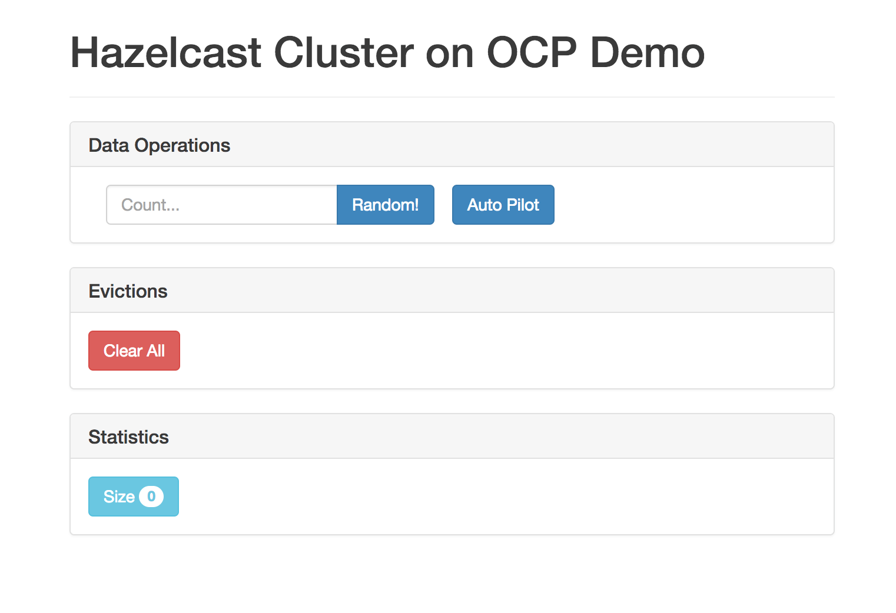

# Openshift Container Platform Client Integration Sample
 
 This is a sample application that shows how to use Hazelcast client within Openshift Container Platform.
 
 This sample application uses [Kubernetes Discovery SPI](https://github.com/hazelcast/hazelcast-kubernetes) when deployed 
 to OCP.
  
  ## Prerequisites
   
   1) Install Docker Engine on your development machine from [Docker Installations](https://docs.docker.com/engine/installation/)
   2) Install Openshift Container Development Kit from [Redhat](https://developers.redhat.com/products/cdk/download/). Please note that
   downloading and installation will require Redhat subscription. Moreover, please follow CDK installation
   [document](https://access.redhat.com/documentation/en-us/red_hat_container_development_kit/2.4/html/installation_guide/)
    
   ## Sample Deployment
   
   ### Step 1
   OCP sample uses [fabric8](https://fabric8.io/) maven plugin to build Docker image, Fabric8 requires 
   3.3.x or higher maven version, therefore make sure that you have proper maven version installed on your machine.
   
   Compile and build snapshot jar file for OCP sample with below command on project root:
   ```
   mvn clean install
   ```
   Traverse to ocp-demo directory under hazelcast-integration, and execute below command to build docker image:
   
   ```
   mvn fabric8:build
   ```
   
   To verify image in Docker please run below command in shell:
   ```
   docker images
   ```
   You should see ``` samples/ocp-demo ``` as a repository.
   
   ### Step 2
   Push ```ocp-demo``` image to docker registry in local OCP installation. You may use ```default``` project in OCP, which
   has already configured docker registry. 
   Please also note that you need to login local docker registry before hand. Please refer to [this document](https://docs.openshift.com/enterprise/3.2/install_config/install/docker_registry.html)
   for docker registry installation in OCP.
   
   ```docker login -a admin -p <your token> <route-to-registry>```
   
   During ```login``` you will probably get SSL handshake error, if you do please add your route to docker insecure
   registry list.
   
   ```docker tag samples\ocp-demo:<version> <route-to-registry>\<your-namespace>\ocp-demo```
   
   ```docker push <route-to-registry>\<your-namespace>\ocp-demo```
   
   You may verify above image stream with ```oc get imagestreams``` command in your OCP installed vm shell.
   
   Please also note that if you configure fabric8 plugin in ```pom.xml```, it will also push ```ocp-demo``` application
   to your local Docker registry. Please refer to fabric8 [documentation](https://maven.fabric8.io/) for details.
   
   ### Step 3
   You may create a Hazelcast cluster on OCP using [this](https://github.com/hazelcast/hazelcast-docker/blob/master/hazelcast-openshift-origin/hazelcast-template.js) Kubernetes config json.
   Please follow OCP documentation to deploy images or Kubernetes templates to your project.
   
   ### Step 4
   Deploy OCP Sample to your project, please use Docker image that is pushed to local registry in Step 2.
   Please follow OCP documentation to deploy images or Kubernetes templates to your project.
   
   ## Step 5
   Create route for OCP sample app in your project in OCP.
   Please follow OCP [documentation](https://access.redhat.com/documentation/en-us/openshift_enterprise/3.2/html/developer_guide/dev-guide-routes) to create route to access sample app.
   Also, you should probably need to add this route your ```hosts``` file, for name resolution.
   
   ### Step 6
   Access to sample app from browser, with the route you defined in Step 5. You should see below home screen.
   
   